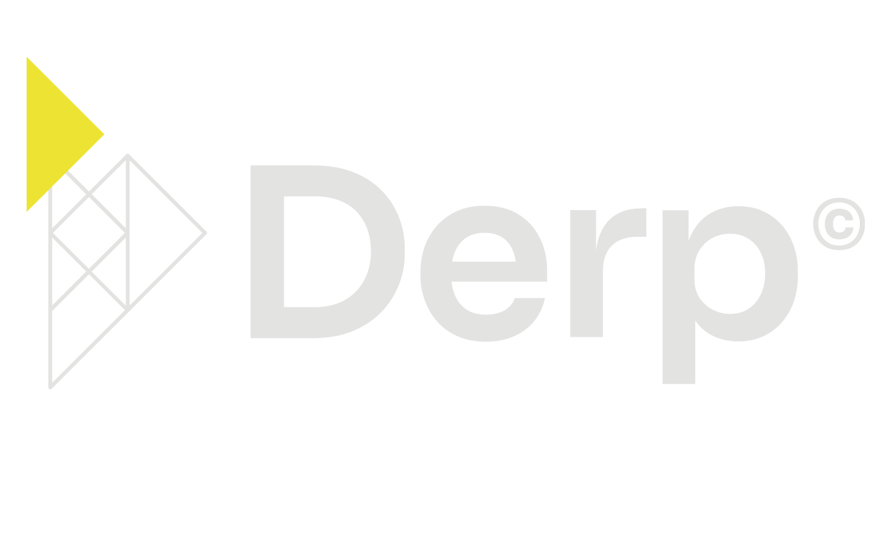

*Decentralized ERP on Internet Computer*

[//]: # ([![License]&#40;https://img.shields.io/badge/License-MIT-yellow.svg&#41;]&#40;LICENSE&#41;)

## 🚀 Vision

DERP (Decentralized Enterprise Resource Planning) is reimagining enterprise resource planning for the Web3 era. By leveraging the Internet Computer Protocol (ICP), we're building a future where business operations are not just automated, but truly decentralized, transparent, and secure.

## 🌟 Key Features

- **True Decentralization**: Built natively on ICP for genuine decentralized operations
- **Smart Contract Integration**: Automated business processes through blockchain technology
- **Enterprise-Grade Security**: Leveraging ICP's robust security architecture
- **Seamless Scalability**: Built to grow with your business
- **Web3-Native**: Designed for the decentralized future

## 🏗 Architecture

DERP Platform consists of four core components, each maintained in its own repository:

### Core Components

| Repository                                                                               | Description | Status |
|------------------------------------------------------------------------------------------|-------------|---------|
| [🏢 DERP Platform](#)                                                                    | Main documentation hub and architecture guidelines |  |
| [⚙️ Platform Canister](https://github.com/IsinBlockchainTeam/DERP-Platform-Canister)     | Core platform logic and smart contracts |  |
| [🏭 Company Canister](https://github.com/IsinBlockchainTeam/DERP-Company-Canister)       | Company-specific business logic and data management |  |
| [🎨 Platform Frontend](https://github.com/IsinBlockchainTeam/DERP-Platform-Frontend-Canister) | Modern, responsive user interface |  |

## 💻 Tech Stack

### 🔮 Backend

- Platform: Internet Computer Protocol (ICP)
- Smart Contracts:
  - Language: [TypeScript](https://tailwindcss.com/) 🔷 
  - Framework: [Azle (TypeScript framework for ICP)](https://demergent-labs.github.io/azle/)⚡ 
- Architecture: Microservices-based with multiple canisters 🔄

### 🎨 Frontend

- Framework: React ⚛️
- UI/Styling:
  - Tailwind CSS for utility-first styling 🌊 
  - [DaisyUI](https://daisyui.com/) for component library 🌼 
- Build Tools: [Create React App](https://create-react-app.dev/) ⚡

## 🌍 ICP Web3 Incubator

DERP Platform is proudly being developed as part of the ICP Web3 Incubator program in Lugano, Switzerland. This initiative supports innovative projects building on the Internet Computer Protocol, fostering the next generation of Web3 solutions.

## 📬 Contact

[//]: # (- Website: [derp.platform]&#40;https://derp.platform&#41;)

[//]: # (- Twitter: [@DERPplatform]&#40;https://twitter.com/DERPplatform&#41;)
- Email: isin-blockchain@supsi.ch

[//]: # (- Discord: [Join our community]&#40;https://discord.gg/your-discord&#41;)

## 🔒 Private Integrations

DERP Platform includes several advanced business logic modules and integrations with existing systems (banking software, traditional ERPs, etc.) that are currently maintained in private repositories for security reasons. These integrations include:

- Banking system connectors
- Legacy ERP migration tools
- Custom business logic modules
- Enterprise-specific adaptors

If you're interested in learning more about these integrations or discussing potential enterprise implementations, please contact the DERP team through our official channels.

## 📄 License

[//]: # (This project is licensed under the MIT License - see the [LICENSE]&#40;LICENSE&#41; file for details.)

Coming soon...

---

**Built with ❤️ by the DERP Team**

